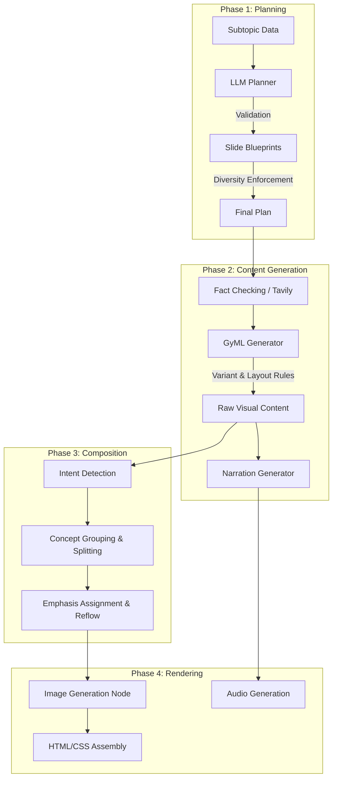

# GYANova: In-Depth Slide Generation Architecture

This document provides a comprehensive, technically detailed breakdown of the GYANova slide generation pipeline. The system employs a **Content-First Architecture**, meaning the visual pedagogical structure is determined and generated *before* any spoken narration is created. This ensures the visuals stand alone as effective teaching tools, and the narration serves to explain them, rather than the visuals merely echoing a script.

---

## 🏗️ System Overview

The pipeline executes in four distinct phases:
1. **The Planner (`new_slide_planner.py`)**: Defines the pedagogical strategy, pacing, and visual templates for a subtopic.
2. **The Content Generator (`content_generation_node.py` & `slides/gyml/generator.py`)**: Uses LLMs to generate structured GyML (Gyanova Markup Language) data, applying strict variant and layout rotation rules.
3. **The Composer (`slides/gyml/composer.py`)**: Processes the raw GyML, logically grouping concepts, enforcing cognitive load limits (auto-splitting), and assigning visual emphasis.
4. **The Renderer (`rendering_node.py`)**: Handles parallel image generation via Leonardo AI and applies the final responsive Bento-style CSS theme.



---

## 🧠 Phase 1: The Slide Planner

**Core File:** `new_slide_planner.py`

The planner receives a subtopic name, difficulty level, and a teacher profile. It outputs an array of JSON objects (the "blueprints"), each representing a single slide.

### 1.1 The Template Registry (`SLIDE_TEMPLATES`)
The system contains over 40 distinct visual templates categorized by pedagogical function.
*   **Hero/Title**: `Title card`
*   **Text & Explanation**: `Title with bullets`, `Title with bullets and image`, `Image and text`, `Text and image`
*   **Columns & Comparisons**: `Two columns`, `Three columns`, `Four columns`
*   **Process & Flow**: `Timeline`, `Arrows`, `Diagram`
*   **Lists & Summaries**: `Icons with text`, `Large bullet list`
*   **Data Layouts**: `Column chart`, `Line chart`, `Pie chart`
*   **Dense Knowledge Building**: `Comparison table`, `Key-Value list`, `Rich text`, `Labeled diagram`, `Formula block`, `Split panel`

### 1.2 The LLM Planning Schema
The LLM is prompted to architect the lesson using the following mandatory fields:
*   `title`: The conceptual title of the slide.
*   `content_angle`: The pedagogical lens. Valid paths are: `overview`, `mechanism`, `example`, `comparison`, `application`, `visualization`, `summary`. The LLM is instructed to architect a progression (e.g., *overview → mechanism → example → application → summary*).
*   `intent`: Action verb defining the slide's purpose: `concept`, `definition`, `process`, `comparison`, `data`, `example`, `summary`, `intuition`.
*   `selected_template`: Must map to the Template Registry.
*   `purpose` and `role`: Used to guide the later narration generation (e.g., "Guide", "Contrast", "Emphasize").
*   `visual_required` (boolean) & `visual_type` (`image`, `diagram`, `none`): Dictates if the Renderer should fetch external media.

### 1.3 Validation and Diversity Enforcement
Once the LLM returns the JSON plan, the system runs strict validation:
1.  **Angle Inference**: If the LLM hallucinates an angle, the system infers it from the template (e.g., if template contains "Timeline", angle becomes `mechanism`).
2.  **Category Restriction (The Variety Rule)**: The system maps templates to broad categories (`timeline`, `bullet`, `card`, `process`, `comparison`, `data`). It throws away any slide that attempts to use a category already used in the same subtopic, enforcing high visual variety.
3.  **Output Limiting**: Clamps the final output to 4-7 slides per subtopic.

---

## ⚙️ Phase 2: Content Generation

**Core Files:** `content_generation_node.py`, `slides/gyml/generator.py`

This phase reads the blueprints and generates the actual text, data, and layout instructions.

### 2.1 Visual Variant Rotation (`generator.py -> pick_variant()`)
To ensure slides with the same template or intent don't look identical across different lessons, the generator rotates sub-variants.
*   **Variant Mapping**: E.g., An `explain` intent maps to `['cardGridIcon', 'cardGridSimple', 'bigBullets']`.

#### Intent & Angle Variant Pools
The following table documents the curated subset of UI components (variants) mapped to each pedagogical angle or intent:

| Angle/Intent | Pool (Ordered Variants) |
| :--- | :--- |
| **overview** | `cardGridIcon`, `bigBullets`, `cardGridSimple` |
| **mechanism** / **narrate** | `timelineSequential`, `timelineIcon`, `processArrow` |
| **example** | `cardGridImage`, `cardGridIcon`, `bulletIcon` |
| **comparison** / **compare** | `comparison`, `comparisonProsCons`, `comparisonBeforeAfter` |
| **application** | `cardGridIcon`, `bulletIcon`, `processSteps` |
| **visualization** / **prove** | `stats`, `statsComparison`, `cardGridSimple` |
| **summary** / **summarize** | `bigBullets`, `bulletCheck`, `bulletIcon` |
| **list** | `bigBullets`, `bulletCheck`, `processSteps` |
| **teach** | `cardGridIcon`, `processSteps`, `bulletIcon` |
| **introduce** | `cardGridSimple`, `bigBullets`, `cardGridIcon` |
| **demo** | `processArrow`, `processSteps`, `processAccordion` |
| **explain** (Fallback) | `cardGridIcon`, `cardGridSimple`, `bigBullets` |
*   **Selection Logic**: 
    1. Looks at the `content_angle` or `intent`.
    2. Filters out variants used in the last 2 slides (`layout_history`).
    3. Uses the `slide_index` modulo the remaining pool to deterministically rotate options.

### 2.2 Layout Balancing (`generator.py`)
To prevent "huge placeholder images" (where a full-screen background overwhelms the text), image layouts are strictly assigned based on index and density:
*   **Index 0 (Intro)**: Forces `behind` layout (full-screen hero image).
*   **Wide Components (Timelines, Process Arrows)**: Forces `top` or `bottom` layouts to ensure they occupy the full slide width and aren't squished by sidebars.
*   **Dense Slides (>5 items)**: Forces a `blank` layout to maximize reading space.
*   **Standard Content**: Alternates between `left` and `right` sidebars to create visual rhythm as the student progresses.

### 2.3 GyML Prompting & Fallbacks
The chosen variant and layout are injected as **MANDATORY DIRECTIVES** into a massive LLM prompt, along with the JSON schema.
*   If the LLM fails to return valid JSON, the system retries (up to 2 times).
*   If, upon parsing, the system cannot find a valid "primary block", it injects a fallback "Title with Bullets" slide.

### 2.4 Synchronized Narration Generation
**Crucial Distinction**: Narration is generated *after* the visual content.
*   The system extracts exactly how many items (e.g., 4 timeline steps) were generated.
*   It prompts a separate LLM call to write exactly that many narration segments, ensuring perfect synchronization between audio and staggered visual animations.

---

## 🎨 Phase 3: Composition & Scaling

**Core File:** `slides/gyml/composer.py`

The Composer acts as a compiler. It takes the raw, unstructured JSON dict from the LLM and parses it into a strongly-typed Internal Representation (IR) consisting of `ComposedSlide`, `ComposedSection`, and `ComposedBlock`.

### 3.1 Concept Grouping & Splitting
The Composer enforces cognitive load limits:
*   **Smart Layout Split**: If an LLM generated 8 items for a Card Grid, and the limit is 6, the Composer intercepts this, creates a secondary slide object (`Slide 1 (1/2)` and `Slide 1 (2/2)`), and splits the cards evenly across them.
*   **Dense Content Reflow**: If a slide is moderately dense but not enough to split, the Composer might forcefully alter the layout (e.g., moving an accent image into a 40/60 CSS column block to free up vertical space).

### 3.2 Visual Hierarchy Assignment
Every IR block is tagged with an `Emphasis` enum (`PRIMARY`, `SECONDARY`, `TERTIARY`). 
*   The "Primary Block" (the core teaching structure, like the `comparison_table` itself) gets `PRIMARY`.
*   Supporting text (`intro_paragraph`, `callout`) gets `SECONDARY`.
*   This data is used heavily by the renderer to determine font weights and background shading.

---

## 🎬 Phase 4: Rendering & Theming

**Core Files:** `rendering_node.py`

This is the state machine that turns the IR into final HTML.

### 4.1 Parallel Image Resolution
Before rendering HTML, the `rendering_node` inspects the IR. If the layout is not `blank` and an `imagePrompt` exists without a resolved URL, it spawns an asynchronous call to Leonardo AI (via `ImageGenerator`). This ensures image generation doesn't block the logic loop.

### 4.2 Bento Generation
The CSS architecture (the "Bento" system) dynamically shapes the HTML grid based on the `image_layout` (`left`, `right`, `top`, `bottom`, `behind`). 
    By combining the IR from Phase 3, the layout rotation from Phase 2, and the theme variables, we get dynamic, responsive slides that never feel monotonous.

---

## 🔬 Deep Dive: Phase 1 - The Slide Planner

To understand exactly how the system "thinks," let's walk through a concrete example of the **Slide Planner** (`new_slide_planner.py`) in action.

### 1. The Input Catalyst
The system is triggered by an API call providing a subtopic object. 
*   **Subtopic**: `"Introduction to Computer Generations"`
*   **Difficulty**: `"Beginner"`
*   **Teacher Profile**: `"Expert Teacher"`

### 2. The Instruction Set (The Prompt)
The Planner Python script takes this data and constructs a strict System Prompt. It injects the following constraints arrays directly into the prompt to limit the LLM's imagination to supported structures:
*   `AVAILABLE_TEMPLATE_NAMES`: [Title card, Two columns, Timeline, Process arrow block...]
*   `SLIDE_INTENTS`: [concept, definition, process, comparison, data...]
*   `CONTENT_ANGLES`: [overview, mechanism, example, application, summary]

The LLM is given a **Critical Rule**: *"ARCHITECT BY ANGLE: Ensure a diverse progression of learning perspectives: overview → mechanism → example → application → summary."*

### 3. The "Thinking" Process (LLM Output)
The LLM evaluates the subtopic conceptually. It decides that teaching "Computer Generations" requires describing a sequence of historical changes. Therefore, it prioritizes `Timeline` and `Comparison` templates.

The LLM returns a structured JSON payload. Here is what a **Sample Planned Slide** looks like from the raw LLM output:

```json
{
  "title": "The Vacuum Tube Era (First Generation)",
  "content_angle": "mechanism",
  "intent": "process",
  "purpose": "intuition",
  "selected_template": "Timeline",
  "role": "Interpret",
  "goal": "Explain how vacuum tubes functioned as the primary logic circuitry in early computers like ENIAC.",
  "reasoning": "A timeline helps students visualize the chronological development and sheer scale of first-gen machines.",
  "visual_required": true,
  "visual_type": "image"
}
```

### 4. The Backend Validation & Stripping Engine
The JSON is received by the python backend (`plan_slides_for_subtopic`), but it isn't trusted immediately. It runs through a gauntlet of validation logic:

**A. Angle Inference Strategy:**
If the LLM provided an invalid `content_angle` (e.g., trying to invent a new angle like `"historical_review"`), the backend runs an inference algorithm based on the `selected_template`.
```python
if "Timeline" in tmpl or "process" in purp:
    angle = "mechanism"
elif "Comparison" in tmpl:
    angle = "comparison"
```

**B. The "Variety Category" Enforcer:**
This is the most crucial part of eliminating monotony. The python dictionary `TEMPLATE_CATEGORIES` groups visually similar templates.
```python
TEMPLATE_CATEGORIES = {
    "Timeline": "timeline",
    "Two columns": "comparison",
    "Comparison table": "comparison",
    "Icons with text": "card",
    "Three columns": "card"
}
```
If the LLM planned Slide 2 to be `Two columns` (Category: `comparison`) and Slide 4 to be `Comparison table` (Category: `comparison`), the backend **rejects and skips** Slide 4. It maintains a `used_categories` set. This guarantees the final 4-7 slides will each use completely physically distinct geometries.

### 5. Passing the Baton
The final, validated array of "Blueprints" is saved into the overall `TutorState` under `state["plans"]`. 

At this point, **no actual slide content (text or images) exists**. The system only knows *what* it needs to build (a Timeline about Vacuum Tubes) and *why* it needs to build it (to build intuition). 

This state is then passed to Phase 2: **Content Node**, which will use these blueprints as hard constraints to write the actual pedagogical material.

---

## 🎨 Deep Dive: Phase 2 - Content Generation (Content-First)

The Content Generation node (`content_generation_node.py` and `slides/gyml/generator.py`) takes the abstract blueprints from Phase 1 and converts them into concrete text, data, and layout instructions.

### 1. The Core Philosophy: "Content-First"
Most AI presentation tools generate a script first and then try to paste bullet points onto a screen. GYANova reverses this.
The System Prompt explicitly instructs the LLM:
> *"You are designing the VISUAL CONTENT of the slide. A teacher's narration will be generated AFTER to explain this content. DO NOT write narration text. Only write concise on-screen labels, headings, and descriptions."*

This ensures the visual slide stands alone as an effective cognitive tool.

### 2. The Variant Rotation Algorithm (`pick_variant()`)
Even if Phase 1 dictates a slide is an `"explain"` intent, we don't want every "explanation" to look like a generic grid of cards.

**A. The Variant Pool:**
`INTENT_VARIANTS` maps an intent or angle to a curated subset of UI components:
```python
"mechanism":     ["timelineSequential", "timelineIcon", "processArrow"],
"comparison":    ["comparison", "comparisonProsCons", "comparisonBeforeAfter"],
```

**B. The Selection Logic:**
When generating Slide 3 (Index: 2), the system calculates:
1. What was the layout history for Slides 1 and 2? (e.g., `["timelineSequential", "processArrow"]`)
2. Filter the pool to remove recently used variants (The *Fresh Pool*).
3. Select deterministically: `variant = fresh[slide_index % len(fresh)]`

This guarantees that over a 15-slide course, visual structures organically rotate, maintaining student engagement.

### 3. The Auto-Balancing Image Layout Engine
Image placement is aggressively managed. The LLM does not get to choose the overall geometry of the slide; the Python backend dictates it based on rules of density and visual weight.

```python
# Rule 1: The Hero Intro
if slide_index == 0:
    image_layout = "behind"   

# Rule 2: The Density Override
elif item_count > 5:
    image_layout = "blank"    # Too dense for images, maximize text space

# Rule 3: The Wide Component Rescue
elif is_wide: # e.g., Timelines, Process Arrows
    image_layout = "top" if (slide_index % 2 == 1) else "bottom"

# Rule 4: Standard Rhythm
else:
    image_layout = "right" if (slide_index % 2 == 1) else "left"
```

These selections (`variant` and `image_layout`) are then injected into the LLM prompt as **MANDATORY DIRECTIVES**.

### 4. The GyML Payload 
The LLM returns structured JSON matching the GyML schema. This contains `contentBlocks` (titles, paragraphs, smart layouts).

### 5. Synchronized Audio Generation
Because the system generated the UI *first*, it now knows exactly how many visual items exist on the screen.

The backend runs `_count_primary_items(gyml_content)`. If it counts exactly 4 items in a Timeline:
1. The backend runs a completely separate LLM call specifically to generate Narration.
2. It prompts the audio LLM: *"You are explaining a timeline with exactly 4 steps. Write exactly 4 matching narration segments."*

This exact alignment is what allows Phase 4 (Rendering) to build stagger-animations where the teacher's voice precisely matches each visual timeline step lighting up on the screen.

---

## 🏗️ Deep Dive: Phase 3 - The Composition Layer

If Phase 1 is the "Architect" and Phase 2 is the "Writer", Phase 3 (`slides/gyml/composer.py`) acts as the "Compiler & Typesetter". It takes the raw, untrusted JSON from the LLM and processes it into a safe, strongly-typed Internal Representation (IR) consisting of `ComposedSlide`, `ComposedSection`, and `ComposedBlock`.

The Composer pipeline runs every slide through a strict 7-step sequence:

### 1. Intent Detection (`_detect_intent`)
Even though Phase 1 planned an intent, the Composer re-verifies it based on what the LLM *actually wrote*.
*   If the LLM output includes an array of dates, the intent is forcefully snapped to `Intent.NARRATE`.
*   If the title contains "vs", it maps to `Intent.COMPARE`.
This prevents a slide that *looks* like a timeline from being accidentally animated like a bulleted list.

### 2. Concept Extraction (`_extract_concepts`)
The Composer extracts the raw data blocks (Title, Subtitle, Smart Layout array) into a memory-safe Python dictionary, completely decoupling the content from the LLM's original JSON structure.

### 3. Limit Enforcement & Auto-Splitting (`_enforce_limits`)
**This is the Cognitive Load guardrail.** 
The system defines maximum acceptable limits for different components (e.g., a `Timeline` should have max 5 items, a `CardGrid` max 6 items) in `constants.py -> Limits`.

If an LLM hallucinates 11 events for a History timeline:
1. The Composer detects `len(items) > 5`.
2. It intercepts the single `ComposedSlide` object and mathematically divides the items list.
3. It spawns two new slide objects: "Slide Title (1/2)" and "Slide Title (2/2)".
4. This ensures that no matter how enthusiastic the LLM gets, a student's screen will never become illegibly dense with text.

### 4. Ordering Grammar (`_apply_ordering`)
The Composer enforces strict typography rules based on `BLOCK_ORDER_GRAMMAR`.
```python
# Defined grammar rule:
BlockOrder.TITLE < BlockOrder.SUBTITLE < BlockOrder.CALLOUT < BlockOrder.PRIMARY_CONTENT
```
Even if the LLM output the "Callout Quote" below the "Timeline", the Composer will physically re-order the IR nodes so that the Callout always appears *above* the primary teaching structure, maintaining consistent pedagogical spacing.

### 5. Emphasis Assignment (`_assign_emphasis`)
Every parsed element gets an `Emphasis` enum:
*   `Emphasis.PRIMARY`: The main teaching tool (e.g., The Process Arrows).
*   `Emphasis.SECONDARY`: High-level context (e.g., The Slide Title, Context Paragraphs).
*   `Emphasis.TERTIARY`: Captions or footnoted text.
This tag tells the Rendering Engine exactly which component should trigger the primary CSS entrance animation.

### 6. Content Distribution (`_distribute_content`)
If a slide survives the split-check but is still "heavy", the Composer triggers a layout reflow.
*   If a `right` (sidebar) layout is requested but the screen has too much text, the Composer intercepts and changes the internal geometry to a "50/50 Split Column" or forces a `blank` layout to give the text more breathing room on the DOM.

### 7. Hierarchy Tagging (`_assign_hierarchy`)
Finally, the Composer wraps the nested `ComposedBlocks` in standard semantic HTML roles (`h1`, `h2`, `article`, `figure`, `figcaption`), allowing Phase 4 (Rendering) to easily map these elements into the BENTO CSS framework.

---

## 🎨 Deep Dive: Phase 4 - Rendering & CSS Theming

The final stage (`slides/gyml/renderer.py` and `rendering_node.py`) is intentionally designed as a **Passive Renderer**. It does no logical thinking; it simply maps the strongly-typed Internal Representation (IR) from Phase 3 into DOM nodes.

### 1. Parallel Image Resolution (Leonardo AI)
Before the HTML is stitched together, the `rendering_node` checks the IR for any unresolved `imagePrompt` strings.
If it finds them, it spawns an asynchronous `asyncio.gather` pool to hit the Leonardo AI API.
*   **Prompt Injection**: It automatically prepends strict style guidelines (e.g., "minimalist vector art, flat colors, transparent background") to the LLM's prompt to ensure all generated images look like they belong in the same premium slide deck.
*   **Non-Blocking**: Because this happens in parallel, rendering 5 images takes exactly as long as rendering 1 image.

### 2. The Bento CSS Engine
GYANova does not use absolute positioning. It uses a modern CSS Grid approach we call the "Bento System".
When rendering the `<section>` tag for a slide, the Python backend injects specific `data-` attributes:
```html
<section 
  class="slide-section" 
  data-image-layout="bottom" 
  data-density="compact">
```
The CSS architecture (in `styles.css`) is written entirely using Attribute Selectors.
*   If `data-image-layout="bottom"`, the CSS Grid splits into `1fr` row for text, `1fr` row for the image.
*   If `data-density="compact"`, variables like `--card-padding` and `--block-gap` are automatically shrunk via CSS `calc()`.

### 3. Dynamic Theming (`theme.py`)
Theme files in GYANova are simple Python data classes containing Hex codes (e.g., `gamma_dark`, `midnight`).
The renderer takes these hex codes and injects them as CSS Custom Properties (`--bg-primary`, `--accent`) at the `:root` level. Because the Bento CSS uses these variables instead of hardcoded colors, switching a deck from "Light Mode" to "Midnight Mode" requires zero structural changes to the HTML.

### 4. Animation Data Injection
This is where the magic of the synchronized teacher voice happens.
If the slide is marked as `animated=True`, the Python renderer loops through ONLY the blocks marked as `Emphasis.PRIMARY` (e.g., the individual steps of a Process Arrow block).

It injects an incrementing `data-segment="X"` attribute onto each card:
```html
<div class="card anim-slide-up" data-segment="0">Step 1</div>
<div class="card anim-slide-up" data-segment="1">Step 2</div>
```
Headers, context paragraphs, and accent images deliberately *do not* receive segment tags, meaning they are visible on frame 1.

When the student hits "Play", the frontend Javascript simply listens to the audio player's timecode. When audio segment `1` begins to play, the JS adds the `.visible` class to `[data-segment="1"]`, triggering the CSS `anim-slide-up` keyframe exactly when the teacher says the corresponding sentence.
